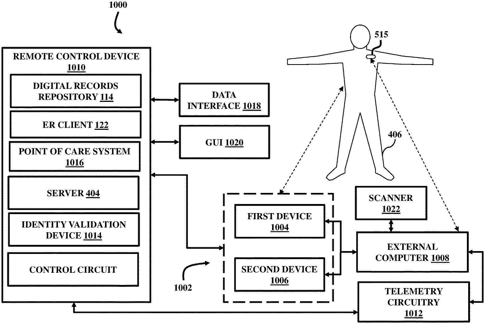

The evolving framework of health care informatics faces multiple technological hurdles. Predominantly, medical institutions, encompassing tertiary care hospitals, geriatric care facilities, and ambulatory clinics, curate an expansive databank of patient-centric records. These datasets amalgamate an individual's demographic metadata, longitudinal medical chronicles, diagnostic imageries, therapeutic prescriptions, among other salient clinical descriptors. With so much medical data to handle, there's a constant need for advanced computer systems that can efficiently track patient histories, manage billing, and review long-term medical records, among other tasks.

## The Imperative of Real-time Health Monitoring

While the use of electronic health record data banks (EHRDB) has been instrumental in centralizing data storage, this technology does not exist without its challenges. For instance, there's the challenge of effective integration with medical devices for real-time and remote care, necessitating a seamless connection between patient records, medical device management, and instantaneous physiological states. Further complicating the matter is the need for timely retrieval of data across various private networks that may undergo frequent changes.

Additionally, with the rapid advancement of telemedicine and remote health monitoring, there's an increased demand for technologies that can sense and interpret the physiological characteristics of a subject and relay that information for immediate or future care.

## Advancements in Multi-device Modules

The introduction of a technology to control multi-device modules serves as a step forward towards resolving these challenges. By embedding a physiological sensor, medical devices can sense the instantaneous physiological characteristics of a subject. This not only facilitates real-time health monitoring but also ensures that the medical apparatus is operating optimally, as indicated by the generated signals from each device.

Furthermore, with its electronic record (ER) client, the remote-control device can wirelessly connect to each private network. This enables it to query the ER database associated with these private networks, ensuring timely access to electronic records without the constraints of network changes.

This proposed technology addresses the extant challenges in the medical field by ensuring efficient real-time monitoring, seamless integration with electronic health record technologies, and unimpeded access to data across changing networks. Such advancements are poised to impact patient care and data management, ensuring better health outcomes and streamlined operational procedures for medical establishments.

 

**Figure 1** 

## Introduction of the Innovative Medical Device Management Technology

### Functional Significance of Physiological Sensing

Central to this technology is the physiological sensing, whose chief role is to grasp the intricate physiological attributes of the subject, converting these real-time characteristics into a digital signal. This digital signature not only represents the instantaneous health state of the subject but also serves as a precursor for more specialized operations.

### Adaptive Wireless Communication

Crucial to the efficiency of this technology is wireless communication. This aims to communicate and adapt based on signals that represent their active or inactive states. Their potential is vast, ranging from therapeutic interventions to diagnostic evaluations and even precise medication deliveries—all orchestrated through computer-guided instructions.

### The Power of Remote Data Access in Bridging Networks

The point which sets this patented technology apart is its capability to tap into diverse data reservoirs. These reservoirs, continuously updated, house digital information about a subject's changing attributes and their reference standards. With the ability to wirelessly connect and query these databases, the technology ensures that the most recent and relevant information is always at its fingertips.

### Intelligent Decision-Making and Harmonizing Device Actions

This technology analyzes physiological signals and optimizes device operations in response. It operates similarly to an advanced algorithm, analyzing the subject's present physiological conditions and orchestrating multiple devices to work together, guaranteeing the best care provision for that specific moment.

### Security and Identity in Personalizing Care

Ensuring the right care for the right individual is paramount. The patented technology here integrates identity validation, associating each device's actions with a subject based on the detected physiological signals. It's like a personal code for each individual, ensuring treatments are specifically tailored for them.