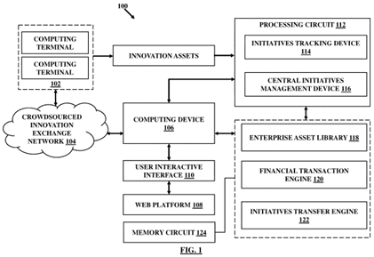

The proposed technology connects multiple computing terminals tied to individual innovators, streamlining the creation and tracking of innovations. By capitalizing on a reliable verification mechanism, the uniqueness, timing, and origin of each innovation are confidently certified.

## Concepts to Digital Realities

Crowdsourcing has transformed from a mere concept to a robust technical field. This technology is specially tailored for tracking, developing, evaluating, and scoring both innovations and sub-innovations in a sprawling distributed technological ecosystem. This transformation is particularly significant given the expansive and interconnected nature of today's digital ecosystems.

## The Conundrum of Evaluating Innovations

During the stage of evaluation of innovations numerous institutions stand prepared to offer financial backing. Despite of there being numerous amount of grants and rewards presented towards transformative ideas, the real challenge for many companies isn't just evaluating these ideas. The task of consistently tracking and nurturing these innovations in a globally connected environment, brimming with a deluge of contributions, proves to be a complex undertaking.

## Harnessing New Technology for Innovation Tracking

This technology, presents itself as a potent solution to these quandaries and by leveraging this technology, we can make sure of the following functionalities being taken care of:

## Integrity Assurance

This patented technology assures that every innovator and their respective computing terminal is genuine which further eradicates the possibility of fraudulent entries into the ecosystem. With the help of advanced verification, the system ensures that every idea originator is genuine, thus mitigating deceptive entries.

## Metadata Imprinting

After the implementation of an innovation, the technology facilitates the embedding of essential metadata. This not only establishes ownership but also provides a clear digital timestamp and geographical origin, ensuring the idea's traceability and credibility.

## Streamlined Evaluation

This technology being transparent and immutable enables organizations to sift through innovations, vetting their authenticity, and evaluating their potential value. This enables the reining of the decision-making process when awarding grants or other financial incentives.

## Global Tracking and Development

With the help of this technology, companies can monitor innovations on a global scale, allowing them to tap into a reservoir of creativity and potential across borders.

This technology paves the way for a more organized, transparent, and efficient avenue for tracking and evaluating crowdsourced initiatives. Not only does it bolster the credibility of the innovations, but it also equips organizations with the necessary tools to recognize and nurture these sparks of creativity.

 

## The Pivotal Role in Crowdsourced Initiatives

By examining a patented technology, we can glean insights into how this dynamic realm is evolving.

## The Functional Core of Crowdsourced Initiatives

This technology consists of the potential to bridge numerous computing terminals, all of which harbor innovations and sub-innovations. This technology ensures that these terminals can communicate over a vast initiatives exchange network.

## Safeguarding Innovation Authenticity

Defining the authenticity of the innovations stand as a challenge. Through Integrity Assurance of this technology one can confirm the legitimacy of every innovator connected to the network.

The technology efficiently embeds metadata to each innovation. This metadata, which comprises essential details such as a digital ownership identity, a timestamp, and geographical origins, fortifies the innovation's trustworthiness.

## Streamlined and Trustworthy Evaluation

The patented technology also stands out for its evaluation prowess which incorporates a central initiatives management device equipped with tools that evaluate the innovations against various criteria. These criteria range from an innovator's credentialed score and referencing indexes to the overlap degree with sub-innovations. Such meticulous evaluation processes ensure that each innovation's merit is accurately gauged, minimizing biases and maximizing fairness.

## The Credibility Quotient

The technology can certify digital profiles associated with each innovator through auto validation. This process employs a thorough comparison of distinct digital profiles, aggregating scores for multiple innovators, ultimately influencing the evaluation of innovations.

All these technologies are driven by blockchain and by emphasizing functionality over structure, the technology paves the way for an era where innovation is not just encouraged but is also protected, evaluated, and authenticated with unmatched precision.